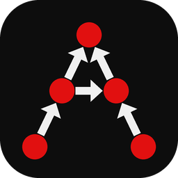

# ANP Studio

**ANP Studio** is a cross-platform **desktop application** for modeling, editing,
calculating, and studying Analytic Network Process (ANP) decision models.

<p align="center">
  
</p>

## Download

Get the latest prebuilt binaries from the
**[Releases](https://github.com/wjladams/anp-studio/releases/latest)** page.

| Platform | Asset |
|---|---|
| Windows x64 | `anpstudio-*-windows-x64.zip` — unzip and run `anpstudio.exe` |
| macOS Apple Silicon | `anpstudio-*-macos-arm64.zip` — unzip, then right-click the app → **Open** (unsigned) |
| Linux x86_64 | `anpstudio-*-linux-x86_64.AppImage` — `chmod +x` the file, then run it |

Windows SmartScreen and macOS Gatekeeper may warn because builds are not code-signed.
Intel Mac builds are not published yet.

To build from source instead, see [Build the GUI](#build-the-gui) below.

## Learn

| You are… | Start here |
|---|---|
| New to ANP? | [What is ANP?](https://bamath.org/anp-studio/guide/concepts/) |
| Know ANP? | [User guide](https://bamath.org/anp-studio/guide/) |
| Looking up a term | [Glossary](https://bamath.org/anp-studio/guide/glossary/) |

---

The computational library (matrices, networks, pairwise judgments, limit
matrix, synthesis, JSON I/O) lives in a separate repository:
**[libanpcpp](https://github.com/wjladams/libanpcpp)** (CMake target
`anpcpp::anpcpp`, C++ namespace `anpcpp`). Model files use JSON format
`anpcpp` (v1/v2) with the default extension **`.anpstudio`** (`.json` still
opens and saves).

This application is inspired by the workflow of
[SuperDecisions](https://www.superdecisions.com/). Numerical behavior is
cross-checked against concepts from [pyanp](https://pyanp.org/) (reference
only).

## Sample models

Ready-to-open `.anpstudio` models live in [`samples/`](samples/). Release builds ship
this directory with the app; use **File → Open Sample…** in ANP Studio (or
**File → Open** on a `.anpstudio` / `.json` file). See [`samples/README.md`](samples/README.md)
for the catalog (Hamburger market share, classic AHP hierarchies, BCR/BOCR
subnetworks, ratings examples, and more). Regenerate with libanpcpp’s
`export_sample_models` example.

Under **Judgments → Ratings**, pick a scale preset (built-in or My scales), cast
votes with label dropdowns, and use **Advanced** to customize; changes apply
when Advanced closes.

## Architecture

```text
libanpcpp (anpcpp::anpcpp)   Toolkit-independent ANP library
anpstudio                    Qt 6 Widgets desktop application (this repo)
```

## Dependencies

| Piece | Choice |
|---|---|
| Build | CMake 3.20+ |
| Language | C++20 |
| ANP library | [libanpcpp](https://github.com/wjladams/libanpcpp) via FetchContent (or sibling checkout) |
| GUI | Qt 6 Widgets |

## Build the GUI

Requires a C++20 compiler, CMake, and Qt 6 Widgets (e.g. `qt6-base-dev` and
`libgl-dev` on Ubuntu/Pop!_OS).

### Sibling checkout (local development)

Place `libanpcpp` next to this repo:

```text
Documents/github/libanpcpp/
Documents/github/anp-studio/
```

Then:

```bash
cmake -S . -B build -DANPSTUDIO_BUILD_GUI=ON
cmake --build build --target anpstudio
./build/gui/anpstudio
```

CMake automatically uses `../libanpcpp` when that tree exists. Override with
`-DANPCPP_SOURCE_DIR=/path/to/libanpcpp` if needed.

### FetchContent from GitHub

If there is no sibling checkout, CMake fetches `libanpcpp` from GitHub
(`GIT_TAG v0.3.0`).

## GUI features

Qt 6 Widgets application (SuperDecisions-style canvas + docks) for creating
networks/subnetworks, editing connections and pairwise judgments, calculating
matrices/priorities, choosing synthesis formulas, and saving/loading JSON —
with full undo/redo via `QUndoStack`.

## Library development

Build, test, and examples for the ANP library belong in **libanpcpp**:

```bash
cd ../libanpcpp
cmake -S . -B build -DANPCPP_BUILD_TESTS=ON -DANPCPP_BUILD_EXAMPLES=ON
cmake --build build
ctest --test-dir build --output-on-failure
```

See that repository’s README for FetchContent / `find_package` consumer docs.

## Documentation

### User guide

**[User guide](https://bamath.org/anp-studio/guide/)** — Structure, connections,
judgments, ratings, and calculations.

**[Glossary](https://bamath.org/anp-studio/guide/glossary/)** — Short definitions
of ANP and Studio terms.

**Site home:** [https://bamath.org/anp-studio/](https://bamath.org/anp-studio/)
(built from `main` via GitHub Actions).

### Developers

**Studio GUI API** (Qt classes): [https://bamath.org/anp-studio/api/](https://bamath.org/anp-studio/api/)

**ANP library (libanpcpp):** [https://bamath.org/libanpcpp/](https://bamath.org/libanpcpp/) ·
[API](https://bamath.org/libanpcpp/api/)

**Local Doxygen** (this repo) requires Doxygen (`sudo apt install doxygen` on Ubuntu).
With the default `ANPSTUDIO_BUILD_DOCS=ON`, `cmake --build build` runs the
same Doxygen pass as CI (`WARN_AS_ERROR`). Docs-only:

```bash
cmake -S . -B build -DANPSTUDIO_BUILD_DOCS=ON -DANPSTUDIO_BUILD_GUI=OFF
cmake --build build --target anpstudio_docs
```

Open **[build/docs/html/index.html](build/docs/html/index.html)**.

For libanpcpp docs with a sibling checkout:

```bash
cd ../libanpcpp
cmake -S . -B build -DANPCPP_BUILD_DOCS=ON -DANPCPP_BUILD_TESTS=OFF -DANPCPP_BUILD_EXAMPLES=OFF
cmake --build build --target anpcpp_docs
```

Open **[../libanpcpp/build/docs/html/index.html](../libanpcpp/build/docs/html/index.html)**.

**Local full site preview** (README landing + guide + API under `/api/`):

```bash
cmake -S . -B build -DANPSTUDIO_BUILD_DOCS=ON -DANPSTUDIO_BUILD_GUI=OFF
cmake --build build --target anpstudio_docs
cp -a build/docs/html docs/site/api
python3 - <<'PY'
from pathlib import Path
import re
src = Path("README.md").read_text(encoding="utf-8")
src = re.sub(r"^# ANP Studio\n+", "", src, count=1)
src = re.sub(
    r"<p align=\"center\">\s*]*>\s*</p>\n*",
    "",
    src,
    count=1,
    flags=re.IGNORECASE,
)
Path("docs/site/README.content.md").write_text(src.lstrip(), encoding="utf-8")
PY
cd docs/site && bundle install && bundle exec jekyll serve --baseurl /anp-studio
```

Enable Pages with **Settings → Pages → Source: GitHub Actions**; see
`.github/workflows/docs.yml`.

## Publishing releases (maintainers)

End users should use **[Download](#download)** above. This section is for
cutting a new GitHub Release so CI attaches binaries.

GitHub Actions builds portable binaries for each **published** release:

| Platform | Artifact |
|---|---|
| Windows x64 | `anpstudio-<tag>-windows-x64.zip` |
| macOS Apple Silicon | `anpstudio-<tag>-macos-arm64.zip` |
| Linux x86_64 | `anpstudio-<tag>-linux-x86_64.AppImage` |

1. Merge the changes you want on `main`.
2. On GitHub open the repo → **Releases** → **Draft a new release**.
3. Under **Choose a tag**, create a new tag such as `0.3.0` (target: `main`).
4. Set the release title (e.g. `ANP Studio 0.3.0`) and optional notes.
5. Click **Publish release** (not “Save draft”—drafts do not start the build).
6. Open the **Actions** tab and watch **Release builds** (Windows, macOS, Linux).
7. When the jobs finish, refresh the Release page; the three assets appear under the release.

**Test a build without publishing:** **Actions** → **Release builds** → **Run workflow**.
Download artifacts from the workflow run page; nothing is attached to a Release.

## Status / remaining work

- Multi-user judgments (core): Scope bar + Judgments Scope rail, roster, samples `18`–`21`
- Consensus / Variance Analysis (Analysis pane): disagreement alignment + vote range (green min–max, mean tick, hybrid stacked dots), coverage, cohort compare
- Still open: harden Google token storage (see [docs/google-oauth.md](docs/google-oauth.md))
- Available: Collect judgments hub (Participants → Collect judgments… / Scope → Collect…) for Excel templates, Google Forms, and CSV; hidden `_meta` round-trip; structure fingerprinting on Forms
- Rating/Direct prioritizers, SuperDecisions `.sdmod` import
- Contribution guidelines

## License

MIT License. See [LICENSE](LICENSE).
