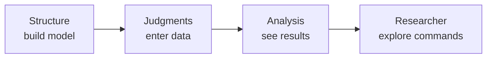

The **Analytic Network Process (ANP)** is a way to structure a decision, capture judgments about importance and influence, and turn those judgments into priorities for the options you care about (the *alternatives*).

This page is a short orientation—not a full textbook. For deeper theory, see the literature on ANP (e.g. work by Thomas Saaty) and related tools such as [SuperDecisions](https://www.superdecisions.com/) and [pyanp](https://pyanp.org/).

## The idea in one minute

1. You have a **decision**: which alternative is best, or how to allocate priority among alternatives.  
2. You group the factors that matter into **clusters** of **nodes** (criteria, stakeholders, options, …).  
3. You draw **connections** that say “this node influences that cluster.”  
4. You enter **judgments** (pairwise comparisons or ratings).  
5. The software builds matrices, computes a **limit** of influences, and reports **priorities**.

A pure **hierarchy** (AHP-style) is the special case with no feedback loops. ANP allows cycles and feedback between clusters.

## Pieces of a model

| Piece | Plain language | In Studio |
|-------|----------------|-----------|
| Alternative | An option you are ranking or choosing among | Often an “Alternatives” cluster (or scores from subnetworks) |
| Cluster | A group of related nodes | Colored boxes on the Structure canvas |
| Node | One element inside a cluster | Circles/labels inside a cluster |
| Connection | “A influences B’s group” | Arrows / links between nodes and clusters |
| Judgment | How much more important A is than B, or a rating | Judgments stage (pairwise or ratings) |

See the [glossary]({{ '/guide/glossary/' | relative_url }}) for more terms.

## From judgments to scores

Rough pipeline (details on [Calculations]({{ '/guide/calculations/' | relative_url }})):

1. **Unscaled supermatrix** — local priorities from pairwise/ratings in each column  
2. **Cluster matrix** — how strongly clusters influence each other  
3. **Scaled (weighted) supermatrix** — cluster weights applied; columns normalized  
4. **Limit matrix** — long-run influence (method chosen per network in the Inspector)  
5. **Global priorities** — priorities of all nodes from the limit matrix  
6. **Alternative scores** — priorities for the alternatives (synthesized when there are subnetworks)

## Stages in ANP Studio

Studio walks you through the work in order:

| Stage | What you do |
|-------|-------------|
| **Structure** | Create clusters and nodes, draw connections, set network options (synthesis formula, limit-matrix method) |
| **Judgments** | Enter pairwise comparisons or ratings for each “with respect to” (wrt) context |
| **Analysis** | Read matrices, globals, alternative scores; try sensitivity and influence |
| **Researcher** | Optional notebook-style commands for inspection and experiments |

## Suggested first session

1. **File → Open Sample…** → `02_ahp_best_car.json`  
2. Look at clusters and links on **Structure**  
3. Open **Judgments** and click a node in the left list to see pairwise (or ratings)  
4. Open **Analysis → Synthesis** and scroll from Scaled Supermatrix through Limit Matrix to Alternative Scores  

When you are ready for feedback networks, open `01_hamburger_marketshare.json`.

Next: [Structure]({{ '/guide/structure/' | relative_url }}) · [Glossary]({{ '/guide/glossary/' | relative_url }})
